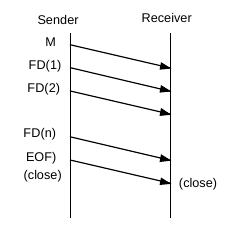
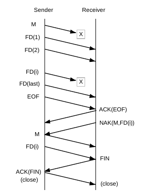

# User Manual

CFDP (CCSDS File Deliver Protocol) enables the transfer of files from one
filestore to another, where the two filestores are in general resident in
separate data systems and often with an intervening space communication link.
In addition to the purely file delivering-related functions, the protocol also
includes file management services to allow control over the storage medium.

For this, each side of the transfer runs a CFDP entity, roughly analogous to
an Internet protocol host.

The functional concatenation of a file and related metadata transferred between
the two CFDP entities is termed a *File Delivery Unit (FDU)*. A transaction
is then the end-to-end transmission of a single FDU between two CFDP entities.
The entity that sends the file is the *source entity* and the one receiving
the file is the *destination entity*. FDU transfers are done through individual,
bounded, self-identifying units called CFDP *Protocol Data Units (PDU)* that are
transmitted between the CFDP entities.

The protocol can operate over a wide range of underlying communication services
and can operate in noisy environments and cope with large signal transmission
delays (as common for interplanetary missions).

This user manual describes on how to utilize the `cfdp` Python module, which
implements the lastest version of the [CFDP Standard](docs/727x0b5.pdf).

## Getting Started

To create an CFDP entity one needs to pass a config object:

```python
import cfdp
cfdp_entity = cfdp.CfdpEntity(config)
```

The `config` object captures the overal system configuration within which the
CFDP protocol operates. It may look like that:

```python
from cfdp.transport import UdpTransport
from cfdp.filestore import NativeFileStore

config = cfdp.Config(
    local_entity=cfdp.LocalEntity(2, "127.0.0.1:5552"),
    remote_entities=[cfdp.RemoteEntity(1, "127.0.0.1:5551")],
    filestore=NativeFileStore("./files"),
    transport=UdpTransport())
```

Here, we use the native filestore and UDP as underlying transport layer. See
further below for implementation details.

Further we specify the configuration of the local entity (the one we are running)
and one or more remote entities (provided as a list). The configurable properties
of entities are referred to as *MIB* in the CFDP standard.

For the local entity those settings are:

```python
LocalEntity(
    entity_id,
    ut_address,
    eof_sent_indication=True,
    eof_recv_indication=True,
    file_segment_recv_indication=True,
    transaction_finished_indication=True,
    suspended_indication=True,
    resumed_indication=True,
    default_fault_handlers=DefaultConfig.fault_handlers)
```

Here:
- `entity_id` is the ID of the local entity
- `ut_address` is the address of the local entity as used by underlying communication protocol
- `eof_sent_indication` sets if "EOF Sent" indications are notified,
- `eof_recv_indication` sets if "EOF Received" indications are notified
- `file_segment_recv_indication` sets if "File Segment Received" indications are notified
- `transaction_finished_indication` sets if "Transaction Finished" indications are notified
- `suspended_indication` sets if "Suspended" indications are notified
- `resumed_indication` sets if "Resumed" indications are notified
- `default_fault_handlers` defines the default fault handlers for each fault condition

> The notification about several indications can be enabled (default) or disabled.
When an indication is enabled, the corresponding method of `CfdpEntity` is called,
for example `CfdpEntity.eof_sent_indication`.

For the remote entities the settings are:

```python
RemoteEntity(
    entity_id,
    ut_address,
    protocol_version_number=ProtocolVersion.VERSION_2,
    positive_ack_timer_interval=DEFAULT_ACK_TIMER_LIMIT,
    nak_timer_interval=DEFAULT_NAK_TIMER_INTERVAL,
    keep_alive_interval=None,
    immediate_nak_mode_enabled=False,
    default_transmission_mode=TransmissionMode.UNACKNOWLEDGED,
    transaction_closure_requested=None,
    check_limit=None,
    type_of_checksum=None,
    disposition_choice=None,
    crc_required_on_transmission=None,
    maximum_file_segment_length=DEFAULT_MAX_FILE_SEGMENT_LEN,
    keep_alive_discrepancy_limit=None,
    positive_ack_timer_expiration_limit=DEFAULT_ACK_TIMER_EXPIRATION_LIMIT,
    nak_timer_expiration_limit=DEFAULT_NAK_TIMER_EXPIRATION_LIMIT,
    transaction_inactivity_limit=DEFAULT_INACTIVITY_TIMEOUT,
    start_of_transmission_opportunity=None,
    end_of_transmission_opportunity=None,
    start_of_reception_opportunity=None,
    end_of_reception_opportunity=None)
```

Here:
- `entity_id` is the ID of the remote entity
- `ut_address` is the address of the remote entity as used by underlying communication protocol
- `protocol_version_number` is the CFDP protocol version implemented at this entity
- `positive_ack_timer_interval`
- `nak_timer_interval`
- `keep_alive_interval`
- `immediate_nak_mode_enabled`
- `default_transmission_mode`
- `transaction_closure_requested`
- `check_limit`
- `type_of_checksum` is the checksum type to use for file transmissions to this entity
- `disposition_choice` sets if incomplete files are discarded or retained in transaction cancellation
- `crc_required_on_transmission`
- `maximum_file_segment_length` is the largest number of bytes a file segment can have
- `keep_alive_discrepancy_limit`
- `positive_ack_timer_expiration_limit` is number of expirations
- `nak_timer_expiration_limit` is number of expirations
- `transaction_inactivity_limit` is a time limit in seconds for inactivity
- `start_of_transmission_opportunity`
- `end_of_transmission_opportunity`
- `start_of_reception_opportunity`
- `end_of_reception_opportunity`

### Class 1 (Unreliable) Transfer

In this transfer mode, the file is sent one-way from the sender to the receiver.
The sender is not informed in any way about whether the transfer was successful,
nor does the receiver make any attempt to recover lost data.



On the receiver side following timer is active:
- *Inactivity timer*: This timer monitors (that is, resets itself) the reception
of incoming PDUs. If timeout is reached, the transfer is considered inactive and
the corresponding fault handler is called.

### Class 2 (Reliable) Transfer

When reliable service is used, the CFDP protocol uses both Negative
Acknowledgments (NAK) and Acknowledgments (ACK). NAKs are used to request
retransmission of lost data. ACKs are used to ensure the receipt of EOF
(End of File) and Finished PDUs.

Since lost data may still be outstanding after the EOF sequence, a Finished PDU
is sent by the receiving entity when all file data has been successfully assembled.
Delivery is ensured by requiring an ACK for the Finished PDU.

There are four selectable NAK strategies, depending on where to send the NAKs.
This implementation supports the *Deferred NAK mode*, where the receiving entity
saves all information about missing data until the EOF is received. It then issues
a NAK to request the missing data.



On the sender side the following timers are used:
- *Inactivity timer*: This timer monitors the transmission of outgoing PDUs.
If timeout is reached, the transfer is considered inactive and the corresponding
fault handler is called.
- *ACK timer*: Triggers if ACK(EOF) has not been received.

On the receiver side the following timers are used:
- *Inactivity timer*: This timer monitors the reception of incoming PDUs. If
timeout is reached, the transfer is considered inactive and the corresponding
fault handler is called.
- *NAK timer*: Started after sending NAK PDUs, to check at timer expiry if the
requested file data has been arrived.
- *ACK timer*: Triggers if ACK(FIN) has not been received.

The timers for ACK(EOF), ACK(FIN), and NAK are started at upon issuance of the item.
Upon receipt of the required response the timer is disabled. Otherwise, the item
is reissued. A count of the number of retransmissions is kept. If the preset limit
of retransmission is reached, a fault is declared.

## Implementation Details

### Underlying Transport Protocol

Currently ZMQ and UDP transport are implemented. See `cfdp.transport`.

### Filestore

As the way the files are stored in the local storage medium may vary, CFDP
defines the concept of virtual filestore with basic file functions, independent
of technology. This is capture in `cfdp.filestore.base.VirtualFileStore`.

This implementation maps the virtual filestore to native Python file functions
in `cfdp.filestore.native.NativeFileStore`. It needs to be initialized with
a rootpath that is other than the root directory (`/`) for the filestore.

```python
from cfdp.filestore import NativeFileStore
fs = NativeFileStore("./files")  # relative native path
fs = NativeFileStore("/tmp/files")  # absolute native path
```

### Transaction

Each transfer of a file is a single transaction. Each transaction carries a
unqiue identifier, the transaction ID. It is composed of two numbers: the source
entity ID and a transaction counter.

### Fault Handlers

To be written...

### Indications

To be written...

### CRC and Checksum

The CRC feature is not implemented. Meaning that for outgoing PDUs, the
calculation and appending of CRC information is not supported. For incoming
PDUs with CRC, an error is raised.

Two checksum types for delivered files are implemented, the modular algorithm
and the null type (no checksum).
